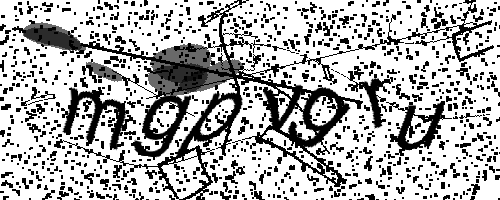
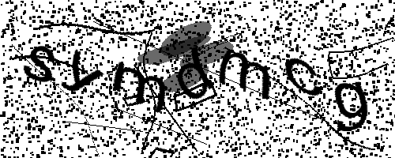
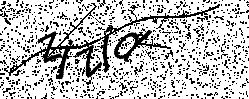
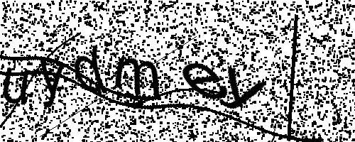

# Kaptcha.NET
[](https://dev.azure.com/twsl/Kaptcha.NET/_build/latest?definitionId=6&branchName=master)  
Kaptcha.NET is simple captcha library for .NET Core projects.


## Motivation
With Google's [reCAPTCHA](https://en.wikipedia.org/wiki/ReCAPTCHA) beeing the de facto standard solution for captchas nowadays, it is pretty much the opposite of a privacy respecting solution. It collects substantial information which can be used to track users and makes complying with GDPR much more complicated.
Therefore I wanted to create a minimalistic, privacy respecting solution, which is simple to implement, yet sufficiently difficult to solve.


## Examples
| | | | |
|-|-|-|-|
| |  |  |  |
| |  |  |  |


## Install
Install the nuget package `Kaptcha.NET`.


## Getting Started
* Add the required captcha services via the service collection extension. You have to use a Cache Provider. You can use SQL Server Cache, In Memory Cache or Distributed Cache (like a Redis).
```csharp
public void ConfigureServices(IServiceCollection services)
{
	//...
	services.AddDistributedMemoryCache(); // Required for the specific default implementation of ICaptchaStorageService
	services.AddCatpcha(Configuration);
	//...
}
```

* In case you prefer to create and use your own, custom implementation of any service, replace '.AddCatpcha(Configuration)' with the following and use your own classes:
```csharp
public void ConfigureServices(IServiceCollection services)
{
	//...
	services.AddCatpchaOptions(configuration);
			.AddCaptchaFontGenerator<FontGeneratorService>();
			.AddCaptchaEffect<EffectGeneratorService>();
			.AddCaptchaKeyGenerator<KeyGeneratorService>();
			.AddCatpchaGenerator<CaptchaGeneratorService>();
			.AddCaptchaStorage<CaptchaStorageService>();
			.AddCaptchaValidator<CaptchaValidationService>();
			.AddScoped(typeof(ValidateCaptchaFilter));
	//...
}
```

* Add the TagHelper to the `_ViewImports.cshtml`
```csharp
@addTagHelper *, Kaptcha.NET
```

* Actually adding the captcha into the ViewPage afterwards is as simple as 
```html
<captcha />
```

* If you want to provide a direkt link to a captcha, add a new controller and inherit from `Controllers\CaptchaController.cs`, which provides all requied methods.
```razor
@{
	var captcha = await generator.CreateCaptchaAsync();
}
<captcha captcha-link="/captcha/@captcha.Id" captcha-id="@captcha.Id" />
```

* Or you can use controller and actions instead of a direct link and let the TagHelper generate the captcha on it'S own.
```html
<captcha asp-controller="Home" asp-action="GetCaptcha" />
```


## Configuration
You can configure the following options:

* Image height (default: `250`)
* Image Width (default: `100`)
* Scaling (default: `2`)
* Background color (default: `Color.White`)
* Foreground color (default: `Color.Black`)
* Number of characters (default: `5 - 8`)
* Charset (default: `"abcdefghijklmnopqrstuvwxyz"`)
* Rotation angle (default: `-30 - 30`)
* Imageformt (default: `PNG`)
* Validation Timeout (default: `5min`)
* Font family (default: `Arial`)
* Font size (default: `22 - 30`)
* Font style (default: `regular`)

To change the default values you need to set the appropriate properties in eigher the `CaptchaOptions` or `FontOptions`. 
Moreover you can enable different effects within the `EffectOptions`.

* `BlobEffect`
* `BoxEffect`
* `LineEffect`
* `NoiseEffect`
* `RippleEffect`
* `WaveEffect`

In ASP.NET Core projects, you can do this via the `appsettings.json` file, an example is provided under `test\Kaptcha.NET.Web`.

## TODO
Currently, `System.Drawing.Common` is used. I plan on replacing it in the future. To use it on Linux, add the following commands to your docker file
```
sudo apt install libc6-dev 
sudo apt install libgdiplus
```
and consider checking out this [blog post](https://www.hanselman.com/blog/HowDoYouUseSystemDrawingInNETCore.aspx) by Scott Hanselman.